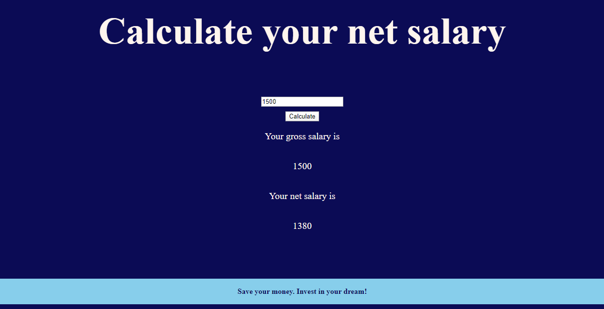

<h1>Salary-Calculator</h1>

The INSS tax must be descounted from the gross salary, resulting in the net salary, according information below: 

Salary range  

 Up to R$ 1.500,00---------------------> Descount 8% 

 From R$ 1.500,01 to R$ 4.000,00	------> Descount 9% 

 Above R$ 4.000,00---------------------> Descount 11% 
            

<h2>Result</h2>

